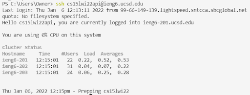

# Lab 1: Remote Access and the File System 

*January 13, 2022*

Welcome to my first tutorial! In this lesson we will learn the basics of connecting to a server via ssh, moving files between the client and server, practicing basic bash commands, and much more! 

**Note**: The following tutorial will be done using a Windows device as the model device. 

## Objectives
1. Download and install VScode
2. Remotely connecting via ssh
3. Learn basic bash commands
4. Moving files over ssh with srp
5. Setting up an ssh key
6. Optimizing remote running

## Procedure

> **1. Downloading and Installing VScode**

1. Navigate to the Visual Studio Code website ([click here](https://code.visualstudio.com/)) to download and install VScode on your device. Make sure the you select the correct version for your device. In this case, we select "Download for Windows": 


2. When installed, open VScode and you should get a window like this:


> **2. Remotely Connecting to a Server**

1. Install OpenSSH ([click here](https://docs.microsoft.com/en-us/windows-server/administration/openssh/openssh_install_firstuse)). This program enables connection to a server via ssh.
2. Lok up your course-specific account for your UCSD course ([click here](https://sdacs.ucsd.edu/~icc/index.php)). Take note of the three letters specifying your account. **Note**: you may need to reset your password. To do so, click "Change your Passowrd". Make sure you indicate "no" for "Change my TritonLink Password". The change may not activate for 10-15 minutes. 
3. Open terminal in VScode (Terminal -> New Terminal)
4. Use the `ssh` command (gives shell to client for steady commands to server) to connect to the server. Make sure to replace `zzz` with your account letters:
```
ssh cs15lwi22zzz@ieng6.ucsd.edu
```
5. Respond "yes" to the authenticity of host message in order to continute connecting.
6. Type your password (IT WON'T SHOW UP AS YOU TYPE) and push "Enter". Once you log in, your screen should look like this:

7. **Note**: This indicates that you (the client) have logged into computer 201 (the server) of the ieng6 cluster. Yay!

> **3. Trying Some Commands**

**Note**: `~` represents your home/base directory
1. These are some useful bash commands to try:
    * `cd` -> change directory
    * `ls`  -> list items in working directory (excluding dotfiles)
    * `ls -l` -> long listing (includes who can read/write, bytes in file, time when last modified)
    * `ls -lat` -> list items in working directory by date 
    * `ls -a` -> list **all** items in working directory (including dotfiles)
    * `pwd` -> print path to current working directory
    * `mkdir` -> create a new folder in working directory
    * `cp` -> cp a file into another file 
    * `cat` -> view the contents of specified file
2. To log out, either
    * Ctrl-D
    * Use the `exit` command

3. Examples of the the commands above:

    **Example of `ls`**
    
    **Example of `ls -l`**
    
    **Example of `ls -lat`**
    
    **Example of `ls -a`**
    
    **Example of `cat`**
    
    **Example of `cp`**
    
    **Example of `exit`**
    

> **4. Moving Files over with scp**

1. When working remotely, it is useful to be able to copy files back and forth between the client and server. Here, we will use `scp`  as seen below to copy files via secure copy from the client to the server: 
```
scp <file(s)> <destination directory path>
```
2. **Note**: if a file is copied from client to server via `scp` AND this file ALREADY exists in the remote home directory, **it will be overwritten on the server**
3. Here is an example:

4. **Note**: this is a time consuming process (change/save file locally, copy updated file to remote server, log into remote server and run file), taking >2min. In the next section, we will see how to more this process more efficient.

> **5. Setting an SSH Key**

1. Every time we log in or run `scp`, we need to type our password. **Solution**: use an `ssh` key. `ssh` keys use the `ssh-keygen ` program to create a public key and private key file. The public key is copied to the server and the private key is stored on the client. The `ssh` command uses the pair of files instead of a password. 
2. (on client) enter `ssh-keygen` into the console. This should result in the "Generating public/private rsa key pair" message.
3. When prompted to enter a file to save the key, you can choose the default.
4. Enter a password when prompted. Make sure to write it down somewhere!
5. Two files now are created: **id_rsa** (private key) and **id_rsa.pub** (public key), stored in the **.ssh directory** on your computer
6. **FOR WINDOWS USERS**: follow these additional `ssh-add` steps to securely store the private key ([click here](https://docs.microsoft.com/en-us/windows-server/administration/openssh/openssh_keymanagement#user-key-generation) or look below)
```
# By default the ssh-agent service is disabled. Allow it to be manually started for the next step to work.

# Make sure you're running as an Administrator.
Get-Service ssh-agent | Set-Service -StartupType Manual

# Start the service
Start-Service ssh-agent

# This should return a status of Running
Get-Service ssh-agent

# Now load your key files into ssh-agent
ssh-add ~\.ssh\id_ed25519
```
7. Next, copy the PUBLIC key to the `.ssh` directory on the server by (1) `ssh` to the server, (2) `mkdir` a `.ssh` directory if needed, (3) logout, (4) `scp` the **id_rsa.pub** file to the `.ssh` directory on the server
8. Congrats! You now can `ssh` and `scp` from your client to the server without entering your password:

> **6. Optimizing Remote Running**
1. Here are some tips and tricks for navigating a remote connection more efficiently:
    * Place quotes around a command at the end of the `ssh` command to directly run it on the remote server and then automatically exit. 
    * Use semi-colons to run multiple commands on the same line
    * Use the up-arrow on your keyboard to recall the last command run
2. Examples
```
# log in, list the home directory on remote server, log out

ssh cse15lzzz@ieng6.ucsd.edu "ls"
```
```
# copy file to another file, compile new file, run new file all in one line

cp WhereAmI.java OtherMain.java; javac OtherMain.java; java OtherMain
```
3. An important distinction:

    * In this example, the first `ls` is run on the server and the second is run on the client


    * In this example, the both `ls` commands are run on the server because of the quotation marks


## Conlcusion

That is it for my tutorial on remote connecting and the file system! Hope it was helpful! :)