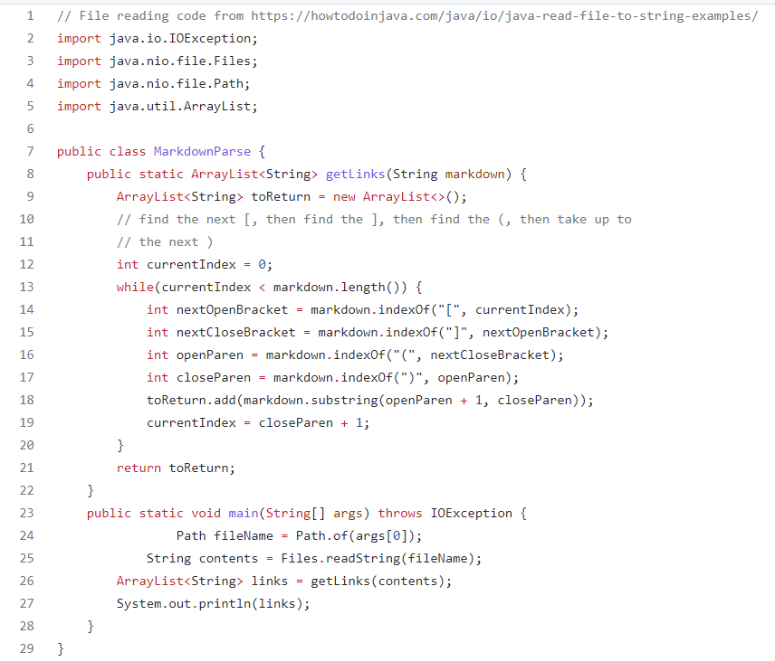
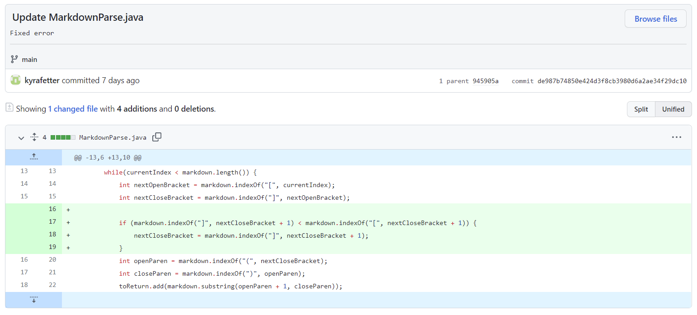
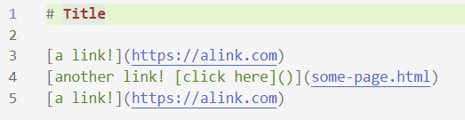
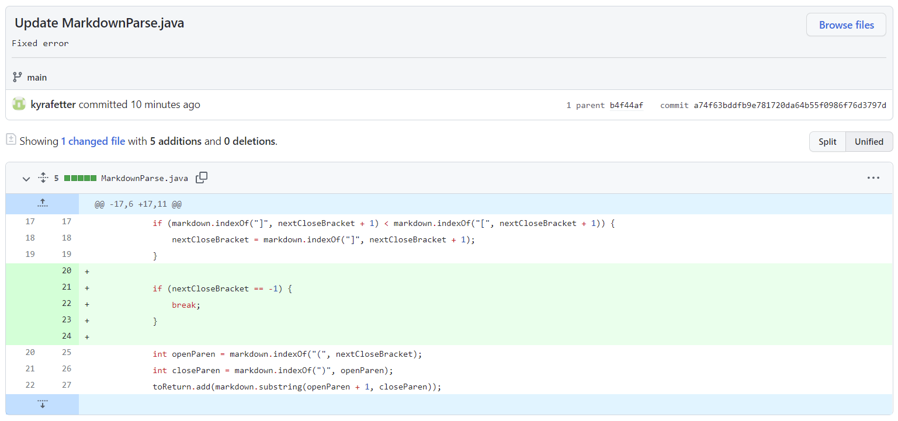
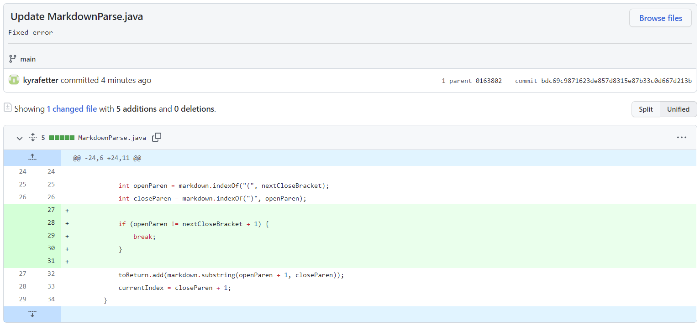
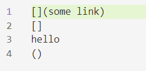

[Home](index.html)

# Labs 3 and 4: Debugging 

*January 28, 2022*

Welcome to my second tutorial! In this lesson we will review the iterative process of debugging as applied to the MardownParse problem. I will take you through 3 examples of bug fixes. Let's go! 

## Objectives
1. Recognize failure-inducing input and its corresponding symptom 
2. Identify and fix the bug in the code
3. Continue to practice using GitHub to document iterative edits and changes to program files

## Important Vocabulary
* **Symptom**: faulty program behavior
* **Bug**: flaw in computer system; may have 0 or more symptoms; multiple bugs may cause the same symptoms
* **Latent Bug**: asymptomatic bug
* **Failure-Inducing Input**: input that causes a bug to execute
* **Deterministic Platform**: platofrm that can reliably reproduce bug from its failure-inducing input

## Intro to MarkdownParse.java
* **Goal**: Write a program that takes a markdown file as a command line argument and then prints out all of the URLs of the links (but not of images) in that file 
* **Original Code**: [click here for repo, developed by Prof. Joe Politz, or see below:](https://github.com/ucsd-cse15l-w22/markdown-parse/blob/main/MarkdownParse.java)



## Time to Debug!

### **Code Change 1**
* **Code Change Diff**

* [**Failure-Inducing Input (click here or see below)**](test-file1.md): a file with two normal links sandwiching a link with `[click here]()` inside the brackets of the link construct

* **Symptom of Failure-Inducing Input**

```
// command used:
java MarkdownParse test-file1.md

// symptom:
[https://alink.com, , https://alink.com]
```
* **Expected Output**
```
[https://alink.com, some-page.html, https://alink.com]
```
* **Relationship between Bug, Symptom, and Failure-Inducing Input**: The bug here was that the MarkdownParser should have ignored characters inside the `[]` of the link construct and not interpreted the `[]()` format as a link inside the `[]` of the actual link. The resulting symptom was that the program counted the embedded `[]()` as the second link when it should have counted the entirety of line 4 as the second link. The bug was revealed by the symptom described above when the failure-inducing input of `test-file1.md` was used as the program input.  

### **Code Change 2**
* **Code Change Diff**

* [**Failure-Inducing Input (click here or see below)**](test-file2.md): a file with `)[`

* **Symptom of Failure-Inducing Input**

```
// command used:
java MarkdownParse test-file2.md

// symptom:
// infinite loop
```

* **Expected Output**

```
[]
```
* **Relationship between Bug, Symptom, and Failure-Inducing Input**: The bug here was that once MarkdownParser established a valid `[`, it did not check for a following `]` in the rest of the file to ensure that the link construct was complete. This bug was revealed through the symptom of an infinite loop when the failure-inducing input of `test-file2.md` was used as the program input.   

### **Code Change 3**
* **Code Change Diff**

* [**Failure-Inducing Input (click here or see below)**](test-file3.md): a normal link followed by `[]`, then text, and then `()`, each being on separate lines

* **Symptom of Failure-Inducing Input**

```
// commmand used:
java MarkdownParse test-file3.md

// symptom:
[some link, ]
```

* **Expected Output**

```
[some link]
```
* **Relationship between Bug, Symptom, and Failure-Inducing Input**: The bug here was that MarkdownParser counted `[] some text ()` as a link when it should not have done so--the bug therefore was an absense of a check to ensure that the `]` came right before the `(` as it should for a valid link construct. This bug was revealed through the symptom of the printing of an empty link when no second link should have been printed. When the failure-inducing input of `test-file3.md` was used as the program input, this bug was revealed through the aforementioned symptom.    

## Conlcusion
That is it for my tutorial on debugging! Hope it was helpful! :)