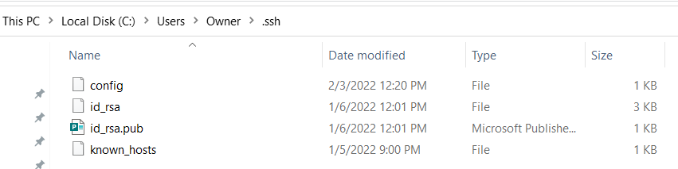
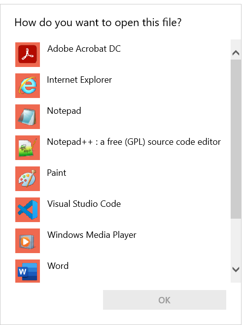
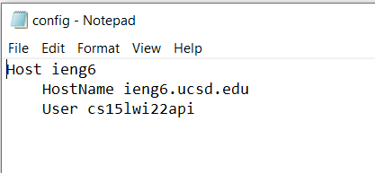
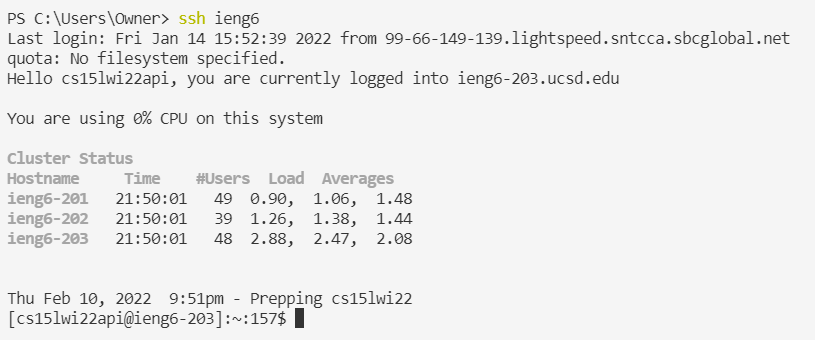
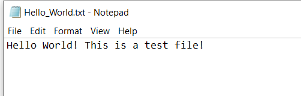
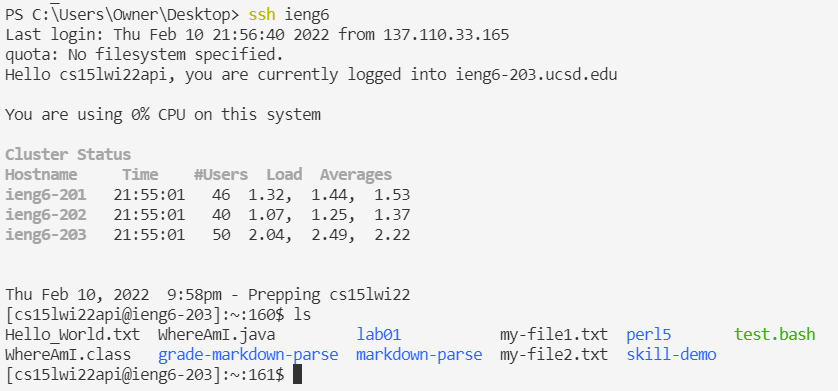

[Home](index.html)

# Lab 5: It Works on My Machine 

*February 10, 2022*

Welcome to my third tutorial! In this lesson we will learn how to streamline ssh configuration to make logging into your server account more efficient. Let's go! 

## Objectives
1. Create a `config` file to store your personal alias 
2. Successfully `ssh` into your account using your newly created alias
3. Copy a file into your account utlizing the alias

## Streamlining ssh Configuration
1. **Create a `.ssh/config` file**: 
* On your computer, navigate to the `.ssh` folder. If not already present, create a `config` file. MAKE SURE IT HAS NO FILE EXTENSION (it should not be .txt, .md, or anything else -- simply `config`). This file will tell `ssh` what username to use when logging into specific servers.

* Open your `config` file by double clicking on it. Choose any of the text editors listed. For this turtorial, I will use Notepad. 

* Add the following lines to your `config` file, replacing `zzz` with your user ID:
```
Host ieng6
    HostName ieng6.ucsd.edu
    User cs15lwi22zzz
```
* Here is what my completed `config` file looks like, edited using Notepad:

2. **Use `ssh` to log into your account using the alias**
* Use this command to log-into your account using your newly-created alias:
```
ssh ieng6
```
* You should be able to log-in to your ieng6 account without typeing your username or password. Congrats!

* You can change `ieng6` to anything you want in your `config` file in order to `ssh` into your server account using any alias you want!

3. **Use `scp` to copy a file to your account using the alias**
* Create a new file on your local computer. I'm going to create the following file and store it on my Desktop:

* Use `scp` to copy your new file from your local computer to your server utlizing your new alias:

* Log into your account and use `ls` to ensure that your file was properly copied:


## Conlcusion
That is it for my tutorial! Hope it was helpful! :)