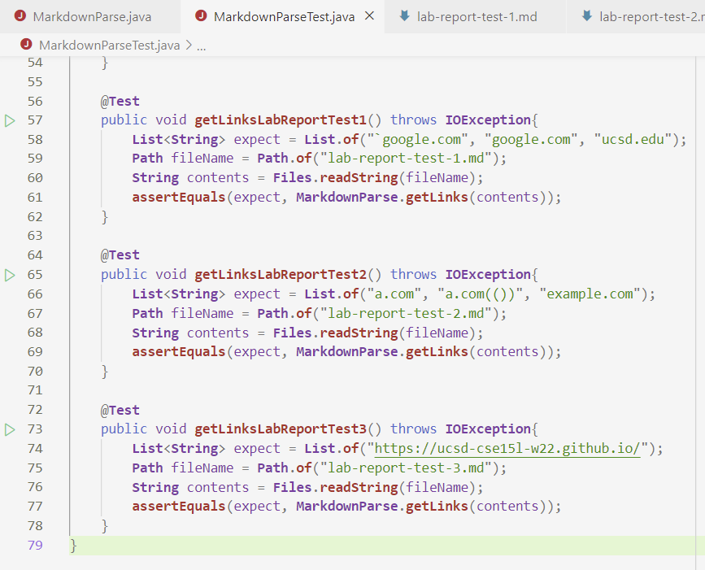
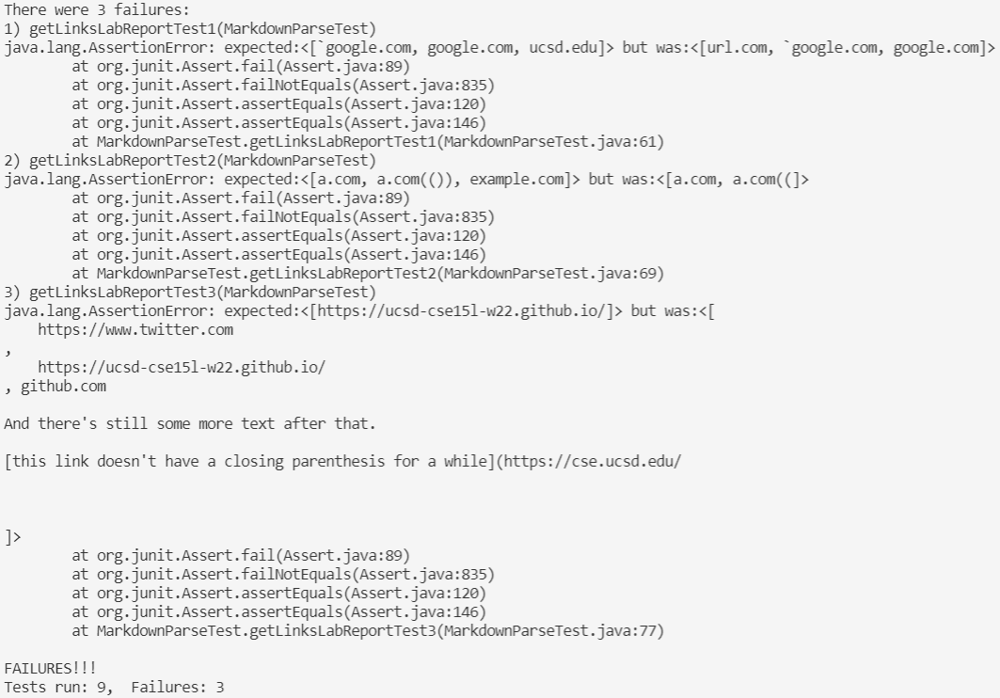
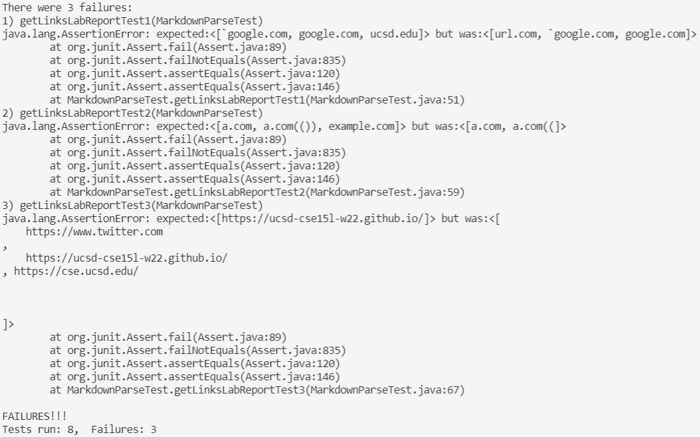

[Home](index.html)

# Labs 6 and 7: Code Review and Automating Testing 

*February 24, 2022*

Welcome to my fourth tutorial! In this lesson we will compare two implementions of `MarkdownParse.java` using three new test files and look at the resulting outputs after running these tests. Let's go! 

## Objectives

1. Clone two repositories holding two different implementations of MarkdownParse 
2. Successfully add three new tests to each `MarkdownParseTest.java` file
3. Compare and analyze resulting outputs

## Three New Test Files

**NOTE: all expected outputs determined using VSCode Preview**

### **Test One**
* Markdown File

```
`[a link`](url.com)

[another link](`google.com)`

[`cod[e`](google.com)

[`code]`](ucsd.edu)
```

* Expected Output

```
[`google.com, google.com, ucsd.edu]
```

### **Test Two**

* Markdown File

```
[a [nested link](a.com)](b.com)

[a nested parenthesized url](a.com(()))

[some escaped \[ brackets \]](example.com)
```

* Expected Output

```
[a.com, a.com(()), example.com]
```

### **Test Three**

* Markdown File

```
[this title text is really long and takes up more than 
one line

and has some line breaks](
    https://www.twitter.com
)

[this title text is really long and takes up more than 
one line](
    https://ucsd-cse15l-w22.github.io/
)


[this link doesn't have a closing parenthesis](github.com

And there's still some more text after that.

[this link doesn't have a closing parenthesis for a while](https://cse.ucsd.edu/


)

And then there's more text
```

* Expected Output

```
[https://ucsd-cse15l-w22.github.io/]
```

## My MarkdownParse Implementation

### **Link to Repository**
* [click here](https://github.com/kyrafetter/markdown-parse) to access my MarkdownParse repository

### **Tests**

* `MarkdownParseTest.java` Code ([click here](https://github.com/kyrafetter/markdown-parse/commit/8ac6846c2fe4ca421183adadd8fe61c602a57c07) for the commit with these changes)


* Test Output: all three tests **did not** pass



## Reviewed MarkdownParse Implementation

### **Link to Repository**
* [click here](https://github.com/christopherthomason/markdown-parse) to access the reviewed MarkdownParse repository

### **Tests**

* `MarkdownParseTest.java` Code


* Test Output: all three tests **did not** pass



## Follow-Up Questions
1. Yes, I think I could make a <10 line change to my code to handle inline backticks. I would add two more variables (nextOpenBacktick and nextCloseBacktick). nextOpenBacktick is calculated from currentIndex and nextCloseBacktick is calculated from nextOpenBacktick. As long as nextOpenBacktick is > nextOpenParen or nextCloseParen when a nextCloseBacktick also exists in the same line, the link should be counted as a link. I would implement this with an if-statement, which should be <10 lines.
2. No, I do not think I could make a <10 line change to handle nested (), brackets, and escapted keys. This is because there are three different "extras" to account for here that have unrelated behavior in md files. Therefore, I don't think I'd be able to easily account for these characters in a couple of condensed test cases in MarkdownParse. I'd need to treat each "extra" as its own case, which would probably result in changes over 10 lines. 
3. Yes, I think I could make a <10 line change to my code to handle newlines in brackets and parentheses. Looking at the expected output, newlines in () are allowed while newlines in [] are not allowed. I could add a short if-statement testing to see if the String between nextOpenBracket and nextCloseBracket contains a "\n" character, and if it does, move nextOpenBracket, nextCloseBracket, nextOpenParen, and nextCloseParen to their next targets. For the () case, I would simply have to use the trim function to trim the additional characters from off the link. I'm pretty sure this would be <10 lines.

## Conlcusion
That is it for my tutorial! Hope it was helpful! :)