[Home](index.html)

# Labs 8 and 9: Debuggers and Using a Script to Run Many Files

*March 9, 2022*

Welcome to my fifth and last tutorial! In this lesson we will compare two implementions of `MarkdownParse.java` using 652 new test files and identify two tests in particular with different results. Let's go! 

## Objectives

1. Clone two repositories holding two different implementations of MarkdownParse 
2. Successfully run the 652 test `md` files on each `MarkdownParse.java` implementation using a bash script and save the results
3. Compare and analyze resulting outputs

## Finding Tests with Different Results

1. I created a bash script to run through all 652 test files and call `MarkdownParse.java` on each of these files in the `test-files` directory

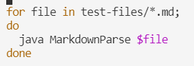

2. I ran the script on the command line, redirecting output into a file

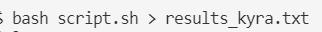

3. I repeated this for both my implementation of `MarkdownParse.java` and for Prof. Politz's implementation

4. I then used `diff` to compare the contents of the results files, identifying differences between them at specific line numbers

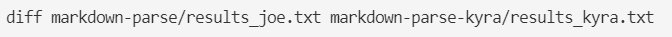

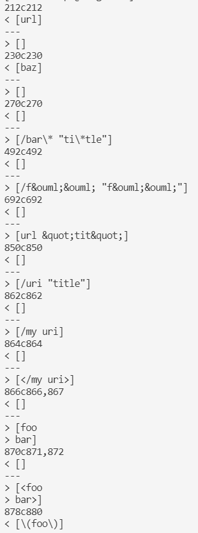

5. Associating the line numbers in `diff` with the test files, I identified two test files with different results:

* **Test File 22 (based on `212c212`)**

    * Prof. Politz's result

    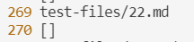

    * My result

    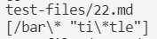

* **Test File 194 (based on `270c270`)**

    * Prof. Politz's result

    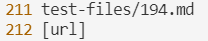

    * My result

    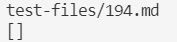

## Test File `22.md`

* **Expected Output according to VScode Preview**: link with name "foo" that links to "ti*tle"

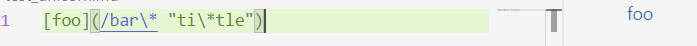

I think that neither my implementation nor Prof. Politz's implementation of `MarkdownParse.java` is correct for Test file 22. We should get an output with the link "ti*tle" as the url, however, looking at both results above, neither had this result since the prof's printed no url, while the mine printed additional text. 

Looking at the my implementation, the bug is that my implementation considers everything within the brackets to be a link; however, according the VScode Preview, spaces are characters that are NOT part of links and that the link url begins after a space, if there is a space present inside the brackets.

To fix this error, we could add a an if statement before the `toReturn.add` command that takes `potentialLink` and uses `indexOf` to determine whether there is a space. If there is a space, we could take the substring of `potentialLink` that begins after the last space and extends to the end. This would be the string we add to `toReturn` instead. 

Here is the code that should be fixed:

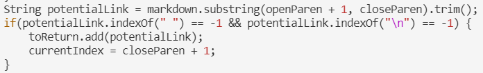

## Test File `194.md`

* **Expected Output according to VScode Preview**: link with name "Foo*bar]" that links to "title (with parens)"

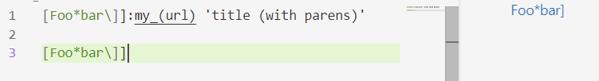

I think that neither my implementation nor Prof. Politz's implementation of `MarkdownParse.java` is correct for Test file 194. We should get an output with the link "title (with parens)" as the url, however, looking at both results above, neither had this result since mine printed no url, while the prof's printed only "url". 

Looking at my implementation, the bug is that my implementation requires that next open paren is located directly after next close bracket, as shown below. However, according to VScode Preview, this is not a requirement for a valid link. 

To fix this error, we need to look at the code below. I'm pretty sure that we actually don't need this if statement since VScode's definition of link syntax appears to be more relaxed that we had thought. 

Here is the code to fix:

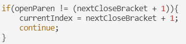

## Conlcusion
That is it for my tutorial! Hope it was helpful! :)